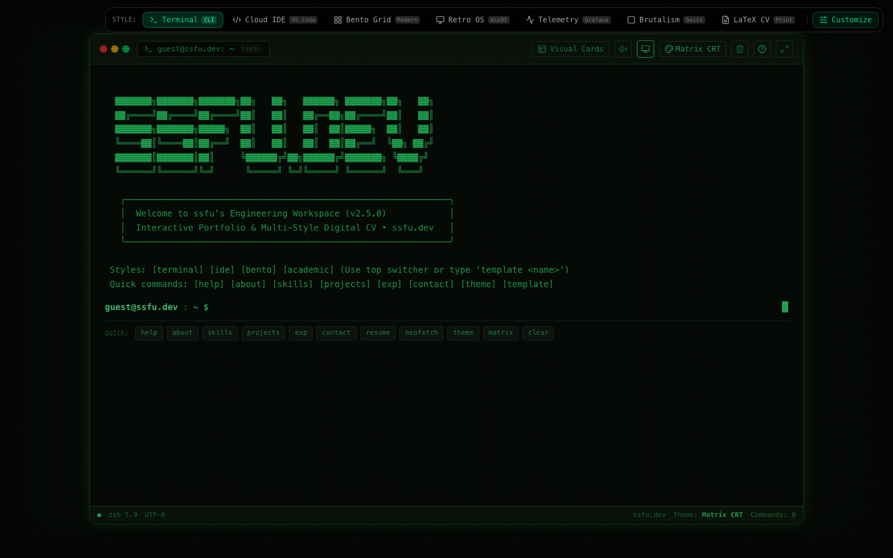
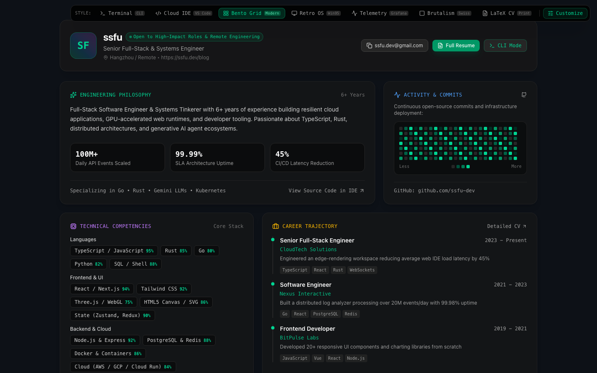
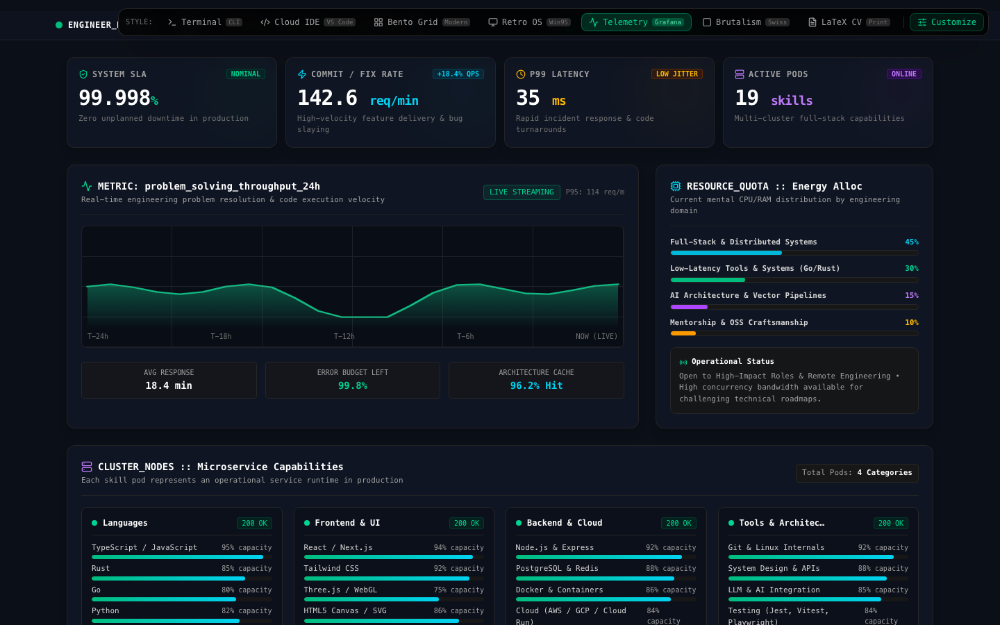

**English | [简体中文](./README.zh-CN.md)**

# Resumatrix

An interactive developer portfolio built with React + Vite. The same resume data can be rendered as seven distinct presentations: Terminal, Cloud IDE, Bento Grid, Retro OS, Telemetry, Swiss Brutalism, and Academic CV.

## Preview

| Terminal | Bento Grid | Telemetry |
| --- | --- | --- |
|  |  |  |

## Features

- Interactive terminal: command history, autocomplete, a virtual file system, project details, and multiple themes
- Seven portfolio templates, switchable instantly via the top-bar switcher
- In-browser profile editor with presets, live saving, and JSON import/export
- Resume viewer with browser print/PDF support
- CRT, Matrix, mechanical keyboard sound, and split-preview enhancements
- Responsive layout for desktop and mobile

## Running Locally

Requires Node.js 24.15 or later. The checked-in `.node-version` is also used by CI and Cloudflare Pages.

```bash
npm install
npm run dev
```

The dev server defaults to `http://localhost:3000`; if the port is taken, Vite automatically picks the next available one.

The app runs entirely in the browser — no API key or environment variables are required. `.env.example` only documents this convention.

## Common Commands

```bash
npm run dev      # Start the dev server
npm run lint     # TypeScript type checking
npm test         # Run the Vitest regression suite
npm run build    # Build production output to dist/
npm run preview  # Preview the production build locally
npm run clean    # Remove generated dist/ and server.js
```

Automated tests cover config restoration, cross-template data consistency, external links, modal keyboard behavior, fullscreen sync, terminal paths, and the favicon. Visual/interaction changes should still be verified in a real browser.

## Customizing the Portfolio

The recommended approach is to edit `DEFAULT_PORTFOLIO_CONFIG` in `src/portfolio.config.ts` directly — it is the single source of truth for the default profile at deploy time. Key fields include:

- `profile`: name, title, bio, status, and key metrics
- `contact`: email, GitHub, LinkedIn, X, blog, and location
- `skills`: skill groups and proficiency
- `experience`: work history and achievements
- `projects`: projects, tags, links, and highlights
- `education`: educational background
- `system`: mock system info used by the Terminal and Telemetry templates

The **Customize** button in the top-right corner saves edits to the current browser's `localStorage` under the key `portfolio_config_v2`. This is suitable for previewing or per-browser persistence, but it does not modify the source code.

The JSON download is currently only a backup/migration format. Placing `portfolio.config.json` at the repository root does not automatically feed the build; to change the live default content, update `src/portfolio.config.ts` instead.

If a local configuration causes the page to misbehave, clear it from the browser console:

```js
localStorage.removeItem('portfolio_config_v2');
location.reload();
```

## Terminal Experience

Type `help` to see the full command list. Common commands include:

```text
about                 Personal bio
skills                Technical skills
projects              Project list
project <id|name>     Project details
exp                    Work experience
contact                Contact info
resume                 Open resume
ls / cat / cd / pwd   Browse the virtual file system
theme <name>           Switch terminal theme
template <name>        Switch display template
matrix / crt / sound   Toggle enhancements
config                 Open the profile editor
```

The terminal supports `Tab` completion, up/down arrow history, `Ctrl+L` to clear the screen, and `Ctrl+C` to clear the current input.

## Project Structure

```text
src/
├── App.tsx                         Global state and terminal command routing
├── portfolio.config.ts             Default profile data and presets
├── types.ts                        Domain types
├── components/
│   ├── templates/                  The seven display templates
│   ├── ConfigCustomizerModal.tsx   Profile editing and import/export
│   ├── ResumeModal.tsx             Resume modal
│   └── Terminal*.tsx               Terminal UI
├── data/portfolioData.ts           ASCII art/virtual file system and legacy data pending migration
└── utils/                          Config validation, URL safety, theming, and procedural sound
```

Architecture, data flow, design constraints, and known gaps are detailed in [DESIGN.md](./DESIGN.md). Development agent conventions are in [AGENTS.md](./AGENTS.md) and [CLAUDE.md](./CLAUDE.md).

## Build & Deploy

```bash
npm run build
```

GitHub Actions runs `npm ci`, type-checking, regression tests, and a production build for pushes to `main` and all pull requests. The workflow lives at `.github/workflows/ci.yml`.

Before deploying, run the same checks locally:

```bash
npm ci
npm run lint
npm test
npm run build
```

### Git-connected deployment

- **Vercel:** open **New Project → Import Git Repository**, select the existing `ssftree/resumatrix` repository, keep the Vite preset, and use `main` as the production branch. The old `ssftree/terminal-website` URL currently redirects to this repository.
- **Cloudflare Pages:** open **Workers & Pages → Create → Continue to Pages → Import an existing Git repository**, select the same existing repository, and configure `main`, `npm run build`, and `dist`.

Both providers build from the same repository. Pushes to `main` publish production deployments, while other branches and eligible pull requests produce previews. The site has no client-side router, so no extra SPA rewrite rule is needed.

Before going live, consider adding:

- Open Graph/Twitter share images and corresponding meta tags
- A canonical URL for the real domain
- A line-by-line review of the sample profile data and external links in `src/portfolio.config.ts`

## Current Technical Debt

The profile text in the virtual file system is still a static fixture, terminal command metadata is spread across three files, and Retro window interactions and print output still lack full automated coverage. See `DESIGN.md` for boundaries and next steps.
